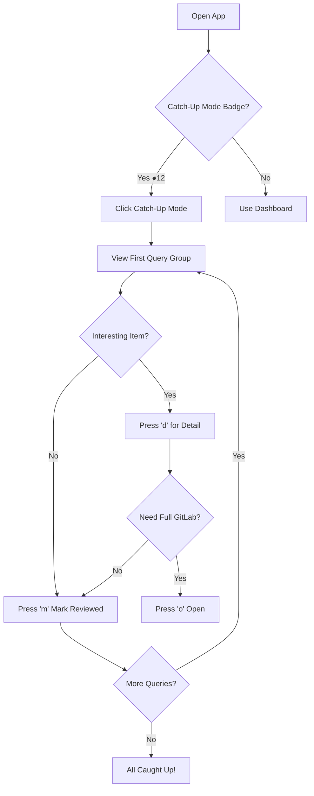
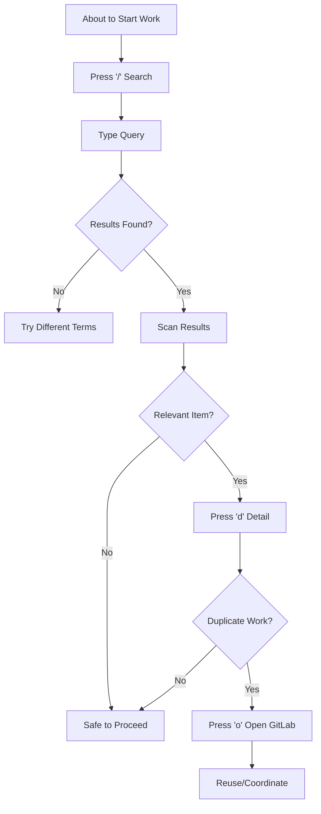

# gitlab-insights UX Design Specification

_Created on 2025-11-20 by BMad_
_Generated using BMad Method - Create UX Design Workflow v1.0_

---

## Executive Summary

**Project:** GitLab Insights - An attention-efficient discovery platform that converts GitLab's pull-based search model into push-based ambient awareness for PM-less engineering organizations.

**Core Innovation:** Solving the "unknown unknowns" problem - discovering conversations you didn't know were happening but should care about.

**Target Users:**
- **Primary:** Mid-senior engineers avoiding duplicate work and discovering relevant discussions
- **High-value:** Tech leads needing coordination visibility (currently 5-10 hrs/week manual sync)
- **Secondary:** Engineering managers (team health), new hires (accelerated onboarding)

**Platform:** Web application (SPA) - modern browsers, internal tool

**MVP Architecture:** Polling-based with scheduled GitLab API fetching every 5-15 minutes, manual refresh capability, and aggressive caching for sub-500ms performance. Real-time webhook infrastructure moved to post-MVP validation phase.

**Design Philosophy (First Principles + Devil's Advocate Refinement):**

Engineer-optimized for **scan efficiency** and **relevance tuning**. The UX prioritizes:

1. **Dense-by-default scanning** (10-15 items visible at once, no scrolling)
2. **Progressive disclosure for context** (one-line summaries → expand on demand → GitLab link for full context)
3. **Keyboard-primary with mouse fallback** (vim-style is the identity, mouse works but keyboard is optimized path)
4. **Transparent relevance on-demand** (hover to see why matched, not always-visible)
5. **Query effectiveness as a separate view** (not inline noise)

The vibe is **"feed reader for code discussions"** - think Feedly, Inoreader, NetNewsWire - optimized for rapid scanning, flagging interesting items, and diving deep selectively.

**Core UX Values:**

1. **Scan Efficiency is Primary**
   - Dense table view by default: 10-15 items visible without scrolling
   - One-line item summaries for speed
   - Card/expanded view on-demand for items that pass initial scan
   - Cognitive speed through LESS visible information, not more

2. **Context Preservation Through Progressive Disclosure**
   - Default: Title, author, date, labels (one line)
   - Hover/expand: Preview snippet, why it matched, more metadata
   - GitLab link: Full context when needed
   - Don't show everything upfront - show enough to decide whether to expand

3. **Keyboard-Primary Identity**
   - Vim-style navigation is the CORE identity (j/k, o, /, f)
   - Mouse works, but keyboard is the optimized path
   - This is a feature, not a compromise - appeals to target users
   - Power users will evangelize a keyboard-first tool; no one evangelizes "it works fine with mouse too"

4. **Transparency on Demand**
   - Hover to see matched keywords highlighted
   - Expand to see which filter/query triggered
   - Separate analytics view for query effectiveness
   - Don't pollute the scan view with metadata

5. **Performance Enables Scan Efficiency**
   - <500ms loads let you switch views without friction
   - <1s search lets you re-filter rapidly
   - <3s manual refresh keeps feed fresh when needed
   - Periodic background sync (5-15 min) maintains data freshness
   - Speed enables exploration, not just consumption

**Key Insights from First Principles + Devil's Advocate:**

- **Feed reader, not GitHub Dashboard** - The mental model is rapid scanning of many items, not notification triaging
- **Dense-by-default is FASTER, not harder** - Seeing 15 items at once beats scrolling through 3 screens
- **Keyboard-primary is a strength, not a barrier** - Target users WANT this, watering it down makes it generic
- **Progressive disclosure > always-visible richness** - Show less upfront, expand on demand
- **Transparency without noise** - Make "why matched" available, not mandatory

**Core User Flows:**
- Morning sync (5 min): Catch-Up Mode shows what's new since last visit, grouped by saved queries
- Pre-work check (3 min): Search before starting, prevent duplicate work
- Periodic check-in: Manual refresh button fetches latest data (throughout day)
- Query discovery: Filter exploration → Save as persistent query
- Catch-up completion: Mark queries as reviewed, return to dashboard

**Performance Requirements:**
- <500ms page loads (enables time-to-insight)
- <1s search results
- <3s manual refresh (API fetch + UI update)
- Keyboard shortcuts available (j/k, /, o, Ctrl+d/u, r for refresh) but not required

---

## 1. Design System Foundation

### 1.1 Design System Choice

**Selected: React Aria Components** (Adobe)

**Decision Rationale:**

React Aria Components chosen for its exceptional keyboard navigation and accessibility support, aligning perfectly with the keyboard-primary identity established in our design philosophy.

**Why React Aria Components:**

1. **Best-in-class keyboard navigation:** Industry-leading focus management, arrow keys, escape handling - essential for keyboard-primary experience
2. **Accessibility without compromise:** WCAG AA+ out of the box, ensures screen reader and keyboard-only users fully supported
3. **Complete design control:** Unstyled components allow creation of unique visual identity with custom accent color
4. **Clean architecture:** Behavior (React Aria) + Styling (Tailwind) = maintainable separation of concerns
5. **Battle-tested:** Built and maintained by Adobe, powers Spectrum design system, mature and stable
6. **Composable primitives:** Build complex interactions (progressive disclosure, dual-mode toggle) from well-designed primitives

**Components Provided:**
- Tables (customize for dense one-line layout)
- Tooltips (hover/focus progressive disclosure)
- Modals/Overlays (expanded item view)
- Menus/Dropdowns (filter UI, query sidebar)
- Form components (filter creation)
- Focus management (keyboard navigation)
- Keyboard handling (shortcuts system)

**What We Build:**
- Visual styling (Tailwind CSS for Linear-inspired aesthetic)
- Dark mode implementation (toggle between light/dark color schemes)
- Catch-Up Mode toggle (custom component using React Aria primitives)
- Query sidebar (custom layout using Menu/Disclosure primitives)
- Sync status indicators (last refresh timestamp, manual refresh button)
- Unique accent color system

**Tradeoffs Accepted:**
- ✅ More initial styling work (but worth it for unique identity)
- ✅ Implement dark mode ourselves (but full control over how it works)
- ✅ More verbose component code (but explicit and maintainable)

**Benefits Gained:**
- ✅ Exceptional keyboard navigation (j/k, focus management, escape, shortcuts)
- ✅ Confidence in accessibility
- ✅ Complete visual design freedom
- ✅ Clean, maintainable architecture
- ✅ Perfect foundation for keyboard-primary identity

---

## 2. Core User Experience

### 2.1 Defining Experience

**The defining experience:** Feed reader for code discussions with dense scanning and progressive disclosure.

**The ONE thing users do most:** Scan the feed in Catch-Up Mode to see what's new since last visit.

**Core interaction:** Scan → Recognize → Decide in <30 seconds
- Dense table view by default (10-15 items visible)
- One-line summaries for rapid pattern recognition
- Expand on-demand for items that pass initial filter
- Keyboard-primary navigation (j/k, o, /, f, m)

**What must be effortless:**
- Scanning 10-15 items in <30 seconds
- Recognizing relevance patterns quickly
- Marking items as reviewed
- Switching between Live and Catch-Up modes

**Most critical to get right:**
- Catching duplicate work BEFORE starting (pre-work check flow)
- Discovering relevant discussions DURING debate (not after decisions made)
- Query relevance tuning (5-15 items, not 0, not 100)

**Dashboard with Catch-Up Mode:**
- **Dashboard:** Shows all stored events from periodic API polling (refreshed every 5-15 min + manual refresh)
- **Catch-Up Mode:** Toggle to show "What's new since last visit" grouped by saved queries
- **Manual refresh:** User-triggered button to fetch latest data immediately from GitLab API
- **Auto-refresh indicator:** Shows last sync timestamp and next scheduled refresh time

**Platform:**
- Web application (SPA)
- Modern browsers only (Chrome, Firefox, Safari, Edge latest)
- Internal tool (no mobile needed, no SEO)
- Desktop displays: 1080p supported, optimized for 1440p (2560x1440), 4K ready
- Keyboard-first with mouse fallback

**Novel aspect:** In-app catch-up workflow eliminates email digest friction while preserving "inbox zero" mental model.

**Desired Emotional Response:**

The emotional shift: From **anxious overwhelm** → **calm awareness**

**Current state (problem):**
- Anxious and guilty about missing discussions
- Frustrated spending 45 min/day searching manually
- Isolated due to information silos
- Overwhelmed by noise (GitLab firehose)

**Desired state (solution):**
- **Calm and oriented** - "I haven't missed anything critical"
- **In control** - transparent filters, predictable system
- **Relieved** - caught duplicate work before investing hours
- **Connected** - discovering relevant discussions, contributing expertise
- **Empowered** - deliberate professional agency vs accidental silos

**Key emotional design principle:** The tool should make users feel like they're **staying informed without effort**, not **working hard to stay informed**.

**Inspiration & UX Patterns:**

**Primary Inspirations:**
1. **Linear** - Design aesthetic and feel
2. **Hacker News** - Data density solutions

**Linear - What to Borrow:**
- Speed-first design: Every interaction feels instant, smooth animations
- Minimal chrome: Maximum content, minimum UI decoration
- Intentional color use: Subtle grays dominate, color signals status/priority
- Command palette (`Cmd+K`): Universal search/navigation for keyboard power users
- Consistent spacing system: 8px grid, breathing room without waste
- Typography hierarchy: Font weight/size creates structure, not borders/boxes
- Dark mode done right: Carefully designed for both modes
- Polished micro-interactions: Hover states, transitions, loading states

**Hacker News - What to Borrow:**
- Dense single-line items: `[icon] [title] [author] [project] [labels] [time]`
- Scannable structure: Consistent format = pattern recognition
- Minimal visual weight: No avatars, no images, pure text efficiency
- Keyboard nav (j/k): Navigate without scrolling, muscle memory
- Functional color only: Event type icons, label colors, new/unread indicators
- Information hierarchy: Title most prominent, metadata smaller/lighter
- No loading spinners: Instant interactions, no perceived latency

**The Synthesis:**
Linear's polished aesthetic + HN's information density = **Fast, clean, dense feed reader that feels professional**

**Applied Design Principles:**
- Clean, minimal interface with intentional color use
- Dense table by default (10-15 items visible, one line per item)
- Keyboard navigation (j/k) as primary interaction
- Progressive disclosure: expand for details, GitLab link for full context
- Smooth interactions that feel instant (<500ms)
- Typography-driven hierarchy
- Consistent 8px spacing grid
- Dark mode support (post-MVP)

**SWOT Analysis Refinements:**

**Strengths of Linear + HN combination:**
- Target audience alignment (engineers already use these tools)
- Speed & efficiency (achieves <500ms goal)
- Information density without overwhelm
- Development simplicity (text-first, consistent patterns)

**Weaknesses addressed:**
- **Visual grouping:** Add subtle section headers and background tints for query groups (HN lacks this)
- **Contextual richness:** Hover/focus shows preview after slight delay (not every item is self-explanatory like HN titles)
- **Dual-mode distinction:** Catch-Up Mode needs clear visual mode (neither app models this toggle)
- **Dark mode:** Skip for MVP (Linear's dark mode is expensive to replicate well)

**Strategic Decisions:**
- ✅ Keep: HN density, Linear polish, keyboard-first identity
- ⚠️ Modify: Add grouping cues, progressive disclosure on hover/focus, visual mode distinction
- ❌ Avoid: Copying task management patterns, assuming pure chronological works, keyboard-only exclusivity

**Progressive Disclosure Pattern:**
- **Default view:** One line per item (dense, scannable)
- **Hover/Focus (slight delay ~300ms):** Tooltip shows preview snippet, matched keywords, metadata
- **Click/Expand:** Inline expansion with full context, comments preview, all metadata
- **Open in GitLab:** Full discussion thread when needed

**Goal:** Make it quick and easy to identify which items need more context AND quick and easy to get that context once you want it.

**Six Thinking Hats - Key Insights:**

**Facts (White Hat):**
- Performance requirements are hard constraints: <500ms loads, <1s search, <3s manual refresh
- Target: 10-15 items scannable in <30 seconds
- MVP uses API polling (5-15 min intervals) not real-time webhooks
- Unknowns: Exact hover delay timing, visual grouping specifics, color palette details

**Emotions (Red Hat):**
- Design feels authentic for developers (useful over pretty)
- Keyboard-first feels empowering (not compromising)
- Density feels respectful of time
- Risk: Feels exclusive (for power users, not everyone) - either strength or fatal flaw

**Risks (Black Hat):**
- One-line density might miss critical context - ensure project name + key labels visible
- Hover dependency fragile - keyboard focus must trigger same preview
- Dark mode absence might kill adoption (engineers expect it in 2025)
- No unique visual identity - "Linear-inspired" isn't a brand

**Benefits (Yellow Hat):**
- Speed creates delight and word-of-mouth marketing
- Density enables flow state (scan 15 items at a glance)
- Progressive disclosure scales across use cases
- Keyboard-first creates community evangelism
- Could become reference implementation for developer dashboards

**Alternatives (Green Hat):**
- Command bar first (Cmd+K driven, no dashboard)
- Card view default instead of table (more forgiving)
- Email + Web hybrid (serve both preferences)
- Desktop widget for ambient awareness

**Critical Decisions Made:**

1. **Dark Mode in MVP:** Include simple dark mode (toggle, basic inversion) - engineers expect it, low cost, high perceived value

2. **Density Level:** Dense table default WITH toggle to card view - let users choose, learn preference through usage

3. **Hover Delay:** Make configurable (150-500ms range), default 250ms - user preference varies

4. **Progressive Disclosure:** Keep three levels (default → hover/focus → expand → GitLab) with clear keyboard shortcuts

5. **Visual Identity:** Define unique accent color beyond "clean and minimal" - need memorable signature

### 2.2 Novel UX Patterns

**Pattern 1: Catch-Up Mode Toggle (In-App Digest)**

**Problem:** Without real-time updates, engineers need a way to quickly see "what's new since I last checked" without scanning the entire feed.

**Solution:** Dashboard toggle to Catch-Up Mode:

```
┌─────────────────────────────────────────────┐
│  [Dashboard]  [Catch-Up Mode ●12]           │
└─────────────────────────────────────────────┘
```

**Catch-Up Mode shows:**
- Items grouped by saved queries
- Only new items since last login/review
- Check off queries as reviewed
- "Mark All as Reviewed" resets baseline
- Badge count shows total new items

**Dashboard shows:**
- All recent stored events (refreshed periodically via API polling + manual refresh)
- Manual refresh button to fetch latest immediately
- Last sync indicator shows data freshness
- Temporary filters apply across all sections

**Benefits:**
- Everything in-app (no external tools needed)
- Explicit "caught up" signal reduces anxiety
- Familiar inbox zero mental model
- Works efficiently with polling-based architecture (no real-time needed for MVP)

**Pattern 2: Dense-by-Default Progressive Disclosure**

**Problem:** Rich previews slow scanning. Sparse views lack context for decisions.

**Solution:** Three-tier information architecture:
1. **Default:** One-line dense table (title, author, date, labels)
2. **Hover/Expand:** Preview snippet, why it matched, metadata
3. **GitLab Link:** Full context when needed

**Pattern 3: Keyboard-Primary Feed Navigation**

**Problem:** Mouse-optimized feeds don't appeal to developer power users.

**Solution:** Vim-style navigation as core identity:
- `j/k` - Navigate items
- `o/Enter` - Open in GitLab
- `/` - Focus search/filter
- `e` - Expand item details
- `m` - Mark as reviewed
- `1/2/3` - Jump to sections (Issues/MRs/Comments)

**Why it works:** Target users (mid-senior engineers) already use vim or vim-mode in editors - familiar mental model.

---

## 3. Visual Foundation

### 3.1 Color System

**Base Colors:**

```css
/* Backgrounds & Primary Text */
--bg-dark: #2d2e2e        /* Dark mode background, Light mode text */
--bg-light: #FDFFFC       /* Light mode background, Dark mode text */
```

**Accent Color (Olive/Moss Green):**

```css
/* Primary accent for active states, new badges, focus indicators */
Dark mode:  #9DAA5F       /* Lightened olive - visible on dark bg */
Light mode: #5e6b24       /* Original olive - strong on light bg */

/* Hover states */
Dark mode hover:  #A8B86C
Light mode hover: #4F5A1F
```

**Usage:** Active query indicators, "New" badges, primary button hovers, keyboard focus rings, link states, active filter chips, manual refresh button, sync indicators.

**Semantic Colors:**

```css
/* Success (rich, bright green) */
Dark mode:  #22C55E       /* Bright, vibrant - clearly "success" */
Light mode: #16A34A       /* Rich, saturated green */
Usage: API sync successful, query created, item marked as reviewed, manual refresh completed

/* Warning (yellow/amber) */
Dark mode:  #FDE047       /* Bright yellow */
Light mode: #F59E0B       /* Amber */
Usage: Filters too broad (>15 items), API polling issues, rate limit warnings, stale data (last sync >30min)

/* Error (urgent red) */
Dark mode:  #DC2626       /* Bright, urgent */
Light mode: #B91C1C       /* Energetic, action-oriented */
Usage: API polling failures, search errors, invalid filters, GitLab connection errors

/* Info (sky blue) */
Dark mode:  #38BDF8       /* Bright, friendly */
Light mode: #0284C7       /* Deeper sky blue */
Usage: Tips, keyboard shortcuts, onboarding hints
```

**Neutral Scale (Grays):**

```css
/* Light Mode */
gray-50:  #F9FAFB        /* Subtle backgrounds, hover states */
gray-100: #F3F4F6        /* Very light borders */
gray-200: #E5E7EB        /* Borders, dividers */
gray-300: #D1D5DB        /* Disabled states, placeholders */
gray-400: #9CA3AF        /* Secondary text, icons */
gray-500: #6B7280        /* Body text - lower contrast */
gray-700: #374151        /* Headings, emphasis */
gray-900: #2d2e2e        /* Primary text */

/* Dark Mode */
gray-50:  #FDFFFC        /* Primary text */
gray-100: #E5E7EB        /* Headings, emphasis */
gray-200: #D1D5DB        /* Body text */
gray-300: #9CA3AF        /* Secondary text, icons */
gray-400: #6B7280        /* Disabled states, placeholders */
gray-600: #4B5563        /* Borders, dividers */
gray-700: #374151        /* Subtle backgrounds, hover states */
gray-800: #1F2937        /* Elevated surfaces, cards */
gray-900: #111827        /* Layering, slightly lighter than bg */
```

**Typography System:**

```css
/* Font Families */
Headings: system-ui, -apple-system, "Segoe UI", sans-serif
Body:     system-ui, -apple-system, "Segoe UI", sans-serif
Mono:     "SF Mono", Monaco, "Cascadia Code", monospace

/* Type Scale (Linear-inspired) */
text-xs:   11px / 16px   /* Metadata, timestamps */
text-sm:   13px / 20px   /* Body text, table rows (HN density) */
text-base: 14px / 24px   /* Default body */
text-lg:   16px / 24px   /* Section headers */
text-xl:   18px / 28px   /* Page titles */
text-2xl:  20px / 32px   /* Catch-Up Mode header */

/* Font Weights */
Regular:   400           /* Body text */
Medium:    500           /* Emphasis, buttons, active states */
Semibold:  600           /* Headings, section titles */
```

**Spacing System (8px Grid):**

```css
1:  4px                  /* Tight spacing, icon gaps */
2:  8px                  /* Base unit - item padding, small gaps */
3:  12px                 /* Comfortable padding */
4:  16px                 /* Section padding, comfortable gaps */
6:  24px                 /* Section margins */
8:  32px                 /* Large section spacing */
12: 48px                 /* Page-level spacing */
16: 64px                 /* Major page divisions */

/* Applied to Layout */
Table row height:  32px  /* Fits 10-15 items on screen */
Table cell padding: 8px horizontal
Section gap:       24px
Page padding:      16px
```

**Event Type Colors (Functional Differentiation):**

```css
/* Issues (Purple) */
Light mode: #8B5CF6
Dark mode:  #A78BFA

/* Merge Requests (Blue) */
Light mode: #0EA5E9
Dark mode:  #38BDF8

/* Comments (Gray) */
Light mode: #64748B
Dark mode:  #94A3B8
```

**Usage:** Small icons or dots next to item titles in dense table view. Provides subtle visual differentiation without decoration.

**Design Principles:**
- System fonts for speed (no web font loading)
- 8px spacing grid for consistency
- Linear-inspired type scale (readable but compact)
- HN-style density (text-sm for table rows)
- Olive/moss green accent provides unique identity
- Functional color use only (not decorative)
- Event type colors subtle and non-competing

**Interactive Visualizations:**

- Color Theme Explorer: [ux-color-themes.html](./ux-color-themes.html)

---

## 4. Design Direction

### 4.1 Chosen Design Approach

**MVP Core: Two-Line Dense Table with Sidebar**

The primary view combines maximum scanning efficiency with meaningful context:

**Table Layout:**
- **2-line rows** (52px height) showing 8-10 items on screen
- **Line 1:** Badge + Title + NEW badge
- **Line 2:** First 80-100 chars of content (gray, smaller font)
- **Comments:** Often fully readable in snippet (key advantage)
- **Issues/MRs:** Enough context to judge relevance

**Sidebar:**
- **Persistent query navigation** (260px width)
- Saved queries with item counts
- Quick filters (Issues/MRs/Comments)
- Project filters
- Active query highlighted

**Layout Rationale:**
Two-line rows strike the optimal balance between density and context. Comments are often short enough to read completely in the snippet, eliminating clicks. For issues/MRs, the first sentence provides enough context to decide whether to dig deeper. The persistent sidebar keeps query management visible without disrupting the scanning flow.

### 4.2 Progressive Disclosure: Toggleable Split Pane

**Secondary View Mode: Email-Style Split Pane**

For items requiring deeper context, users can toggle into split pane mode:

**Split Pane Layout:**
- **List pane:** 480px on left, compressed 2-line items
- **Detail pane:** Remaining space on right, full content preview
- **Selected item:** Highlighted in list, full preview in detail pane
- **Navigation:** j/k keys move selection, preview updates instantly

**Toggle Mechanics:**
- **Keyboard shortcut:** Press `d` (detail) to toggle split pane on/off
- **Animation:** Smooth 200ms ease-out transition
  - Table slides left, detail pane slides in from right
  - No jarring layout shifts, feels fluid
- **Persistent setting:** User preference saved
  - Checkbox in settings: "Always show detail pane"
  - For 1440p+ monitors (≥2560px), split pane defaults to on (can toggle off)
  - For 1080p displays (1920-2559px), split pane defaults to off (can toggle on)
- **Responsive:** On narrower screens (<1600px), split pane goes full-width overlay

**Detail Pane Contents:**
- Full issue/MR description or complete comment thread
- Matched keywords highlighted
- Which query matched (transparency)
- Metadata grid (author, project, labels, time)
- Action buttons: "Open in GitLab", "Mark as Reviewed", "Next (j/k)"

**Design Decision Rationale:**

Starting with full-width table maximizes density for rapid scanning (MVP core workflow). The toggleable split pane provides an on-demand "deep reading mode" without sacrificing screen real estate when not needed. The smooth animation makes the transition feel natural, not disruptive. Users on large monitors can enable it permanently, effectively getting an email-style interface. This approach serves both workflows: fast triage and deep understanding.

**Key Benefits:**
- ✅ Default: Maximum density for scanning
- ✅ On-demand: Full context without leaving the page
- ✅ Persistent: Can make permanent for high-res users
- ✅ Animated: Feels polished and intentional
- ✅ Familiar: Email app pattern users already understand

### 4.3 Visual Design Language

**Aesthetic:** Linear-inspired minimalism with Hacker News density

- **Clean, minimal interface** with intentional color use (olive accent)
- **Typography-driven hierarchy** (no heavy borders or decoration)
- **Functional color only** (event type icons, NEW badges, status)
- **8px spacing grid** for consistency
- **System fonts** for speed (no web font loading)

**Polish Details:**
- Smooth 200ms transitions on hover, selection, mode changes
- Subtle focus indicators (2px olive border on keyboard selection)
- Progressive disclosure layers (table → split pane → GitLab)
- Consistent visual feedback (selection, hover, active states)

**Interactive Mockups:**

- Initial Design Directions: [ux-design-directions.html](./ux-design-directions.html)
- Integrated Concepts: [ux-integrated-concepts.html](./ux-integrated-concepts.html)
- Two-Line Row Concept: [ux-two-line-concept.html](./ux-two-line-concept.html)
- Tooltip & Split Pane Designs: [ux-tooltip-designs.html](./ux-tooltip-designs.html)

---

## 5. User Journey Flows

### 5.1 Critical User Paths

Based on the core workflows identified in the PRD, here are the detailed user journey flows with specific UI interactions:

---

#### Journey 1: Morning Sync (Catch-Up Mode)

**User Goal:** See what's new since last visit, grouped by saved queries

**Entry Point:** User opens GitLab Insights in the morning

**Flow:**

1. **Land on Dashboard**
   - App loads, shows last sync time: "Last sync: 5m ago"
   - Dashboard mode shows all recent items (full feed)
   - User sees badge on "Catch-Up Mode" button: "●12"

2. **Switch to Catch-Up Mode**
   - Click "Catch-Up Mode" button OR press `c` key
   - View transitions to grouped layout
   - Items grouped by saved queries, only showing items since last visit
   - Each query section shows count: "Security Items (3 new)"

3. **Scan Through Queries**
   - Sidebar shows saved queries with "NEW" counts
   - Main area shows 2-line items for first query (Security Items)
   - User scans 8-10 items in ~20-30 seconds
   - Comments are often fully readable in snippet

4. **Deep Dive on Interesting Item** (Optional)
   - User sees interesting item: "Add support for custom webhook endpoints"
   - Press `d` key to toggle split pane
   - Detail pane slides in smoothly (200ms animation)
   - Full description loads, matched keywords highlighted
   - Shows: "Matched Query: Security Items: label:security OR project:api-gateway"

5. **Mark Query as Reviewed**
   - Press `m` key to mark current query as reviewed
   - All items in "Security Items" marked as seen
   - Badge updates: "●12" → "●9"
   - Auto-advance to next query with new items

6. **Complete Catch-Up**
   - Cycle through all queries with new items
   - When last query reviewed, show: "✓ All caught up!"
   - Return to Dashboard view automatically
   - No new badges remain

**Success State:** User feels oriented, knows nothing critical was missed, ready to start work

**Time to Complete:** 5-10 minutes depending on number of new items

**Key Interactions:**
- `c` - Toggle Catch-Up Mode
- `j/k` - Navigate items
- `d` - Toggle detail pane
- `m` - Mark current query as reviewed
- `o` - Open in GitLab (if needs full context)

---

#### Journey 2: Pre-Work Check (Prevent Duplicate Work)

**User Goal:** Search before starting work to avoid building something that already exists

**Entry Point:** User about to start implementing a feature, wants to check first

**Flow:**

1. **Focus Search**
   - Press `/` key from anywhere
   - Search input appears at top of main content
   - Keyboard focus in search field

2. **Enter Search Query**
   - Type: "webhook rate limiting"
   - As they type, search narrows items in real-time
   - Results update in table below (<1s response)

3. **Scan Results**
   - See 3 relevant items:
     - Issue: "Add support for custom webhook endpoints"
     - MR: "Implement rate limiting for API endpoints"
     - Comment: "We should also consider rate limiting for webhooks..."
   - All show in 2-line format with snippets

4. **Check Detail on MR**
   - Press `d` to open split pane on MR
   - See full description: "Adds Redis-based rate limiting..."
   - Realize: Rate limiting already implemented, can reuse for webhooks!

5. **Open in GitLab**
   - Press `o` to open MR in GitLab
   - Review code, understand implementation
   - Can reuse this pattern instead of reimplementing

6. **Save as Query** (Optional)
   - Search was useful, want to monitor this topic
   - Press `s` (save) while search is active
   - Modal appears: "Save as query"
   - Enter name: "Webhook Related"
   - Query saved to sidebar

**Success State:** User discovers existing work, avoids 4-6 hours of duplicate effort

**Time to Complete:** 3-5 minutes

**Key Interactions:**
- `/` - Focus search
- Type to filter
- `j/k` - Navigate results
- `d` - Detail pane
- `o` - Open in GitLab
- `s` - Save search as query

---

#### Journey 3: Periodic Check-In Throughout Day

**User Goal:** Quick check during work to see if anything new and relevant appeared

**Entry Point:** User switches to GitLab Insights tab between tasks

**Flow:**

1. **Quick Glance at Dashboard**
   - App already open in browser tab
   - See "Last sync: 8m ago" in header
   - Notice badge on sidebar: "Security Items" shows "●2"

2. **Manual Refresh** (Optional)
   - Want latest data immediately
   - Click refresh button OR press `r` key
   - Indicator shows: "Syncing..." for 1-2 seconds
   - Updates to: "Last sync: just now"
   - New items appear with "NEW" badges

3. **Check New Items in Security Query**
   - Click "Security Items" in sidebar OR press `1` (query shortcut)
   - See 2 new items at top:
     - NEW: "Security audit findings: SQL injection risks"
     - NEW: Comment on "Implement rate limiting..."

4. **Quick Scan**
   - First item (SQL injection) looks critical
   - Read snippet: "Security audit findings: SQL injection risks"
   - Press `o` to open immediately in GitLab
   - Needs attention now

5. **Mark Second as Reviewed**
   - Navigate to comment with `j` key
   - Read full comment in 2-line snippet
   - Not urgent, just FYI
   - Press `m` to mark as reviewed
   - Badge updates: "●2" → "●1"

6. **Return to Work**
   - Close GitLab Insights tab
   - Addressed critical item, filtered noise
   - Continue with primary task

**Success State:** User stays informed without context switching overhead

**Time to Complete:** 30 seconds - 2 minutes

**Key Interactions:**
- `r` - Manual refresh
- `1/2/3` - Jump to query by number
- `j/k` - Navigate
- `o` - Open in GitLab
- `m` - Mark as reviewed

---

#### Journey 4: Query Discovery and Tuning

**User Goal:** Create effective saved query that surfaces 5-15 relevant items, not 0 or 100

**Entry Point:** User wants to monitor specific type of discussion

**Flow:**

1. **Start with Broad Search**
   - Press `/` to focus search
   - Type: "authentication"
   - See 47 results - too many!

2. **Refine Search**
   - Add filter: "authentication label:security"
   - Results narrow to 23 items
   - Still too broad

3. **Further Refine**
   - Try: "authentication label:security author:@alex"
   - Results: 8 items
   - Scan through - all relevant!

4. **Save as Query**
   - Press `s` to save
   - Modal: "Save as query"
   - Enter name: "Auth Security (Alex)"
   - Description: "Security issues/MRs about auth from Alex"
   - Click "Save"

5. **Verify in Sidebar**
   - New query appears in sidebar
   - Shows current count: "Auth Security (Alex) (8)"
   - Click to activate - items load in main view

6. **Monitor Over Time**
   - Over next few days, new items match query
   - Badge appears when new: "Auth Security (Alex) ●3"
   - In Catch-Up Mode, this becomes a section

**Success State:** User has personalized monitoring for specific discussion type

**Time to Complete:** 2-5 minutes for initial creation

**Key Interactions:**
- `/` - Search
- Type query syntax
- `s` - Save as query
- Name and save

---

#### Journey 5: Deep Reading with Split Pane

**User Goal:** Understand full context of complex discussion thread

**Entry Point:** User sees interesting item but needs more than snippet

**Flow:**

1. **Identify Item of Interest**
   - Scanning in table view
   - See: "Implement rate limiting for API endpoints"
   - Snippet shows: "Adds Redis-based rate limiting to prevent API abuse..."
   - Wants full details before deciding to engage

2. **Toggle Split Pane**
   - Press `d` key
   - Smooth animation (200ms): table slides left, detail pane slides in
   - Selected item highlighted in list (olive border)
   - Detail pane loads full content

3. **Read Full Context**
   - Detail pane shows:
     - Complete MR description (3 paragraphs)
     - Matched keywords highlighted: "rate limiting", "security"
     - Matched query shown: "Security Items: label:security"
     - Metadata: +234 -67, 3 comments, @chris, 1h ago

4. **Navigate Through Items**
   - Press `j` to move to next item
   - Detail pane updates instantly (<100ms)
   - Can rapidly read through multiple items
   - Split pane stays open for sequential reading

5. **Take Action**
   - Found item that needs response
   - Press `o` to open in GitLab
   - OR press `m` to mark as reviewed and move on

6. **Close Split Pane**
   - Press `d` again to toggle off
   - Smooth animation: detail pane slides out, table expands
   - Returns to full-width scanning view

**Success State:** User understands full context, makes informed decision about engagement

**Time to Complete:** 30 seconds per item in split pane mode

**Key Interactions:**
- `d` - Toggle split pane
- `j/k` - Navigate items (updates preview)
- `o` - Open in GitLab
- `m` - Mark as reviewed
- `d` - Close split pane

---

### 5.2 Flow Decision Points and Error Handling

**Decision Point: When to Use Split Pane vs Click Through to GitLab**

- **Use Split Pane:** Item needs more context than snippet, but might not need full GitLab
  - Example: MR with implementation details you want to read
  - Example: Comment thread you want to understand
- **Click Through:** Need to take action (comment, review, code view)
  - Example: Need to approve MR
  - Example: Want to see code changes
  - Example: Need to respond to comment

**Error Handling:**

- **No New Items in Catch-Up Mode:** Show "✓ All caught up! No new items since your last visit."
- **Search Returns No Results:** Show "No items match your search. Try broader terms or different filters."
- **Query Returns 0 Items:** Show in sidebar as "Query Name (0)" - not an error, just nothing matches currently
- **Query Returns 100+ Items:** Show warning icon in sidebar: "Query Name (142 ⚠️)" - suggest user refine query
- **API Sync Fails:** Show error banner: "⚠️ Sync failed. Last successful sync: 15m ago. [Retry]"
- **GitLab Connection Error:** Show modal: "Can't connect to GitLab. Check your connection and try again."

**Keyboard Shortcut Conflicts:**

- `j/k` standard for navigation (Gmail, Reddit, HN - muscle memory)
- `/` standard for search (Gmail, Slack, VS Code)
- `o` standard for "open" (Gmail, GitHub)
- Avoid conflicts with browser shortcuts (Ctrl+, Cmd+)
- Show keyboard shortcut help with `?` key

---

### 5.3 Flow Diagrams

**Morning Sync Flow (Mermaid):**



**Pre-Work Check Flow:**



---

## 6. Component Library

### 6.1 Component Strategy

**Design System: React Aria Components + Tailwind CSS**

React Aria Components provides unstyled, accessible primitives with excellent keyboard navigation. We style them with Tailwind CSS for complete control over the visual design.

---

#### Components from React Aria Components

**Table Component:**
- **Usage:** Main 2-line dense table for item list
- **What React Aria Provides:** Focus management, keyboard navigation (arrow keys, Home/End), row selection
- **Our Styling:** 52px row height, olive border on selection, hover states
- **Custom Behavior:** j/k navigation override (vim-style instead of arrow keys)

**Tooltip Component:**
- **Usage:** Future enhancement for hover previews (post-MVP)
- **What React Aria Provides:** Positioning, show/hide logic, accessibility
- **Our Styling:** Dark background, olive border, custom positioning
- **Custom Behavior:** 300ms delay before showing

**Dialog/Modal Component:**
- **Usage:** Save query modal, settings modal, error dialogs
- **What React Aria Provides:** Focus trap, Esc to close, overlay click handling
- **Our Styling:** Dark modal, backdrop blur, smooth fade-in animation
- **Custom Behavior:** Auto-focus on primary input field

**Button Component:**
- **Usage:** Refresh button, action buttons, modal buttons
- **What React Aria Provides:** Keyboard interaction (Space/Enter), disabled states
- **Our Styling:** Primary (olive), secondary (gray), icon-only variants
- **Custom Behavior:** Loading states with spinner

**Search/Combobox Component:**
- **Usage:** Search input with filter syntax support
- **What React Aria Provides:** Autocomplete behavior, keyboard nav through suggestions
- **Our Styling:** Minimal input with focus olive border
- **Custom Behavior:** Filter syntax hints, real-time search

**Checkbox Component:**
- **Usage:** Settings: "Always show detail pane", query options
- **What React Aria Provides:** Checked/unchecked states, keyboard toggle
- **Our Styling:** Olive checkmark, minimal design

---

#### Custom Components We'll Build

**SplitPane Component:**
- **Purpose:** Toggleable split pane layout with animation
- **Composition:** Uses React Aria's focus management
- **States:**
  - `closed` - Full-width table
  - `opening` - 200ms slide-in animation
  - `open` - List (480px) + Detail pane
  - `closing` - 200ms slide-out animation
- **Props:**
  - `isOpen: boolean`
  - `selectedItem: Item`
  - `onToggle: () => void`
  - `animationDuration: number` (default: 200ms)
- **Keyboard:** `d` to toggle, manages focus between panes

**QuerySidebar Component:**
- **Purpose:** Persistent sidebar with saved queries
- **Composition:** List of interactive items with badges
- **Sections:**
  - Saved Queries (user-created)
  - Quick Filters (Issues/MRs/Comments)
  - Projects (if multi-project support)
- **States:**
  - Active query (olive background)
  - Hover state (slight highlight)
  - Badge counts (item count, new count)
- **Props:**
  - `queries: Query[]`
  - `activeQueryId: string`
  - `onQuerySelect: (id) => void`
- **Keyboard:** `1-9` number keys jump to query by position

**ItemRow Component:**
- **Purpose:** 2-line table row with badge, title, snippet, metadata
- **Variants:**
  - `issue` - Purple badge, issue icon
  - `merge_request` - Blue badge, MR icon
  - `comment` - Gray badge, comment icon
- **States:**
  - `default` - Normal appearance
  - `hovered` - Slight background highlight
  - `selected` - Olive border (when in split pane mode)
  - `dimmed` - Lower opacity (when another row selected)
- **Props:**
  - `item: GitLabItem`
  - `isSelected: boolean`
  - `isNew: boolean`
  - `onClick: () => void`
- **Rendering:**
  - Line 1: Badge + Title + NEW badge (if new)
  - Line 2: Snippet (first 80-100 chars)
  - Right: Metadata (author, project, time)

**DetailPane Component:**
- **Purpose:** Full content preview in split pane mode
- **Sections:**
  - Header: Badge, title, NEW badge, item number (e.g., "!456")
  - Matched Query: Shows which query matched and why
  - Content: Full description/comment with matched keywords highlighted
  - Metadata Grid: Author, project, labels, time, stats (+234 -67, 3 comments)
  - Actions: "Open in GitLab", "Mark as Reviewed", "Next (j/k)"
- **Props:**
  - `item: GitLabItem | null`
  - `matchedQuery: Query`
  - `onOpenGitLab: () => void`
  - `onMarkReviewed: () => void`
  - `onNavigate: (direction: 'next' | 'prev') => void`
- **Loading State:** Skeleton loader while content fetches
- **Empty State:** "Select an item to view details"

**CatchUpModeToggle Component:**
- **Purpose:** Switch between Dashboard and Catch-Up Mode
- **Visual:** Two-button toggle (like view toggle in mockups)
- **States:**
  - Dashboard mode: "Dashboard" active
  - Catch-Up mode: "Catch-Up Mode ●12" active (with badge count)
- **Props:**
  - `mode: 'dashboard' | 'catchup'`
  - `newItemCount: number`
  - `onToggle: () => void`
- **Keyboard:** `c` key to toggle

**SyncIndicator Component:**
- **Purpose:** Shows last sync time and manual refresh button
- **Display:** "Last sync: 5m ago" + Refresh button
- **States:**
  - `idle` - Normal display
  - `syncing` - Shows spinner, "Syncing..."
  - `success` - Brief checkmark, then back to idle
  - `error` - Red error icon, "Sync failed. [Retry]"
- **Props:**
  - `lastSyncTime: Date`
  - `status: 'idle' | 'syncing' | 'success' | 'error'`
  - `onRefresh: () => void`
- **Keyboard:** `r` key to trigger refresh

**Badge Component:**
- **Purpose:** Event type badges (Issue, MR, Comment)
- **Variants:**
  - `issue` - Purple background, "Issue" or icon
  - `merge_request` - Blue background, "MR" or icon
  - `comment` - Gray background, "Comment" or icon
  - `new` - Olive background, "NEW"
- **Size:** Small (11px text), compact padding
- **Props:**
  - `type: 'issue' | 'merge_request' | 'comment' | 'new'`
  - `text?: string` (optional override)

---

### 6.2 Styling Approach

**Tailwind CSS + Custom CSS Variables**

**Why Tailwind:**
- Utility-first matches our component-driven architecture
- No CSS file bloat (purges unused styles)
- Consistent spacing with 8px grid
- Easy to maintain olive accent color across components
- Fast development without context switching

**Custom CSS Variables:**
```css
:root {
  /* Olive/Moss Accent */
  --accent-light: #9DAA5F;      /* Dark mode */
  --accent-dark: #5e6b24;       /* Light mode */
  --accent-hover-light: #A8B86C;
  --accent-hover-dark: #4F5A1F;

  /* Backgrounds */
  --bg-dark: #2d2e2e;
  --bg-light: #FDFFFC;

  /* Neutrals (mapped to Tailwind gray scale) */
  /* See Section 3.1 for full color system */
}
```

**Tailwind Config Customization:**
```js
theme: {
  extend: {
    colors: {
      olive: {
        DEFAULT: '#5e6b24',
        light: '#9DAA5F',
        hover: '#4F5A1F',
      }
    },
    spacing: {
      // 8px grid system
    },
    animation: {
      'slide-in': 'slideIn 200ms ease-out',
      'slide-out': 'slideOut 200ms ease-out',
    }
  }
}
```

**Component Styling Patterns:**
- **Table rows:** `h-[52px] border-b border-gray-600 hover:bg-gray-800 cursor-pointer transition-colors`
- **Selected row:** `ring-2 ring-olive`
- **Sidebar item:** `px-3 py-2 rounded-md hover:bg-gray-800 active:bg-olive text-sm`
- **Badge:** `px-2 py-0.5 rounded-full text-xs font-medium`
- **Buttons:** `px-4 py-2 rounded-md font-medium transition-colors`

---

### 6.3 Component Hierarchy

```
App
├── AppHeader
│   ├── CatchUpModeToggle
│   ├── SyncIndicator
│   └── SearchInput (React Aria Combobox)
├── MainLayout
│   ├── QuerySidebar
│   │   ├── QuerySection (Saved Queries)
│   │   ├── QuerySection (Quick Filters)
│   │   └── QuerySection (Projects)
│   └── ContentArea
│       ├── ContentHeader
│       │   ├── QueryTitle
│       │   └── QueryDescription
│       ├── SplitPane
│       │   ├── TableView
│       │   │   ├── ItemRow (x8-10 visible)
│       │   │   │   ├── Badge
│       │   │   │   ├── ItemTitle
│       │   │   │   ├── ItemSnippet
│       │   │   │   └── ItemMeta
│       │   │   └── ...more ItemRows
│       │   └── DetailPane (when isOpen)
│       │       ├── DetailHeader
│       │       ├── MatchedQuery
│       │       ├── DetailContent
│       │       ├── DetailMetadata
│       │       └── DetailActions
│       └── KeyboardShortcutHelper (? key to show)
└── GlobalModals
    ├── SaveQueryModal (React Aria Dialog)
    ├── SettingsModal
    └── ErrorModal
```

---

## 7. UX Pattern Decisions

### 7.1 Consistency Rules

These patterns ensure consistent behavior across the entire application, preventing "it works differently on every page" confusion.

---

#### Button Hierarchy & Usage

**Primary Action (Olive):**
- **Style:** `bg-olive text-white hover:bg-olive-hover`
- **Usage:** Main action in a context
  - "Open in GitLab" (most common action)
  - "Save Query" in modal
  - "Refresh" button (manual sync)
- **Rule:** Maximum one primary button per screen area

**Secondary Action (Gray):**
- **Style:** `bg-gray-700 text-gray-100 hover:bg-gray-600`
- **Usage:** Supporting actions
  - "Mark as Reviewed"
  - "Cancel" in modals
  - "Next (j/k)" navigation hints
- **Rule:** Can have multiple secondary buttons

**Tertiary Action (Text Only):**
- **Style:** `text-gray-400 hover:text-gray-200 underline`
- **Usage:** Low-priority actions
  - "Skip" or "Maybe Later"
  - Links to documentation
  - "Show keyboard shortcuts"

**Destructive Action (Red):**
- **Style:** `bg-red-600 text-white hover:bg-red-700`
- **Usage:** Irreversible actions (rare in MVP)
  - "Delete Query" (requires confirmation)
- **Rule:** Always require confirmation modal

---

#### Feedback Patterns

**Success Feedback:**
- **Pattern:** Toast notification, top-right, auto-dismiss 3s
- **Style:** Green left border, checkmark icon
- **Usage:**
  - "Query saved successfully"
  - "Marked as reviewed"
  - "Sync completed"
- **Sound:** None (visual only)

**Error Feedback:**
- **Pattern:** Toast notification or inline, persists until dismissed
- **Style:** Red left border, X icon, "Dismiss" button
- **Usage:**
  - "Failed to sync with GitLab"
  - "Invalid search syntax"
  - "Connection error"
- **Inline vs Toast:** Inline for form errors, toast for system errors

**Warning Feedback:**
- **Pattern:** Inline banner or badge icon
- **Style:** Yellow/amber left border, warning triangle
- **Usage:**
  - "Query returned 142 items (too broad)"
  - "Last sync was 30+ minutes ago"
  - "Rate limit approaching"
- **Persistence:** Stays until user fixes condition

**Info Feedback:**
- **Pattern:** Subtle inline text or tooltip
- **Style:** Blue accent, info icon
- **Usage:**
  - "Press ? for keyboard shortcuts"
  - "Split pane shortcut: press 'd'"
  - Onboarding hints (first time only)
- **Dismissal:** User can permanently dismiss hints

**Loading States:**
- **Pattern:** Depends on context
- **Options:**
  - Spinner for short waits (<3s): Refresh button, manual sync
  - Skeleton loader for content: ItemRow placeholders while loading
  - Progress bar for long operations: Bulk actions (future)
- **Rule:** Never show blank screen during load

---

#### Navigation Patterns

**Active State Indication:**
- **Sidebar queries:** Olive background, white text
- **Table rows (selection):** 2px olive ring around row
- **Breadcrumb/Header:** Query title bold, olive underline
- **Rule:** Only one active item per section

**Keyboard Focus Indicators:**
- **Pattern:** 2px olive outline (ring-2 ring-olive)
- **Applies to:** All interactive elements
- **Skip Links:** "Skip to main content" for accessibility
- **Focus Trap:** Modals trap focus, can't Tab out until closed

**Navigation History:**
- **Pattern:** Browser back/forward works for query selection
- **URL Structure:** `/dashboard`, `/catchup`, `/query/:id`
- **State Preservation:** Query selection persists in URL
- **Rule:** Deep linkable - can share URL to specific query view

**Breadcrumb Usage:**
- **Pattern:** None in MVP (single-level navigation via sidebar)
- **Future:** If sub-query or filtering added, show breadcrumb trail

---

#### Empty State Patterns

**First Use (No Queries):**
- **Pattern:** Centered illustration + guidance
- **Message:** "Welcome to GitLab Insights!"
- **Guidance:** "Get started by creating your first query. Press / to search, then press 's' to save."
- **CTA:** "Create First Query" button

**No Results (Search):**
- **Pattern:** Centered text, helpful suggestions
- **Message:** "No items match your search"
- **Guidance:** "Try broader terms, check spelling, or remove filters"
- **Helpful:** Show example searches

**Empty Query (0 items):**
- **Pattern:** Inline message in table area
- **Message:** "No items match this query right now"
- **Context:** "This query: `label:security author:@alex`"
- **Guidance:** "Items will appear here when they match"

**All Caught Up (Catch-Up Mode):**
- **Pattern:** Success message with checkmark
- **Message:** "✓ All caught up! No new items since your last visit."
- **Context:** Show last visit time
- **CTA:** "Return to Dashboard" (auto after 3s)

**Network Error (Can't Load):**
- **Pattern:** Error state with retry
- **Message:** "Can't load items right now"
- **Guidance:** "Check your connection and try again"
- **CTA:** "Retry" button

---

#### Modal Patterns

**Size Variants:**
- **Small (400px):** Simple confirmations
  - "Delete query?"
  - "Mark all as reviewed?"
- **Medium (600px):** Form modals (default)
  - Save Query modal
  - Settings modal
- **Large (800px):** Complex forms or previews (future)
  - Advanced query builder

**Dismiss Behavior:**
- **Esc key:** Always closes modal
- **Click outside:** Closes modal IF no unsaved changes
- **X button:** Always present in top-right
- **Unsaved changes:** Show confirmation: "Discard changes?"

**Focus Management:**
- **On Open:** Auto-focus first input field
- **On Close:** Return focus to trigger element
- **Tab order:** Stays within modal until closed

**Overlay:**
- **Style:** `bg-black/60 backdrop-blur-sm`
- **Animation:** Fade in 150ms, fade out 100ms
- **Click outside:** Dimissable (with unsaved check)

---

#### Form Patterns

**Label Position:**
- **Pattern:** Above input (not inline, not floating)
- **Rationale:** Clear, accessible, works with all input types
- **Spacing:** 4px gap between label and input

**Required Field Indicator:**
- **Pattern:** Asterisk (*) after label, not before
- **Color:** Olive (matches accent)
- **Screen reader:** aria-required="true"

**Validation Timing:**
- **Pattern:** onBlur (after user leaves field)
- **Rationale:** Don't show errors while user is typing
- **Exception:** Real-time for search (instant feedback valuable)
- **Success state:** No visual indicator (neutral is success)

**Error Display:**
- **Pattern:** Inline below field, red text, error icon
- **Message:** Specific, actionable
  - Bad: "Invalid input"
  - Good: "Query name must be 3-50 characters"
- **Persistence:** Until user fixes and re-validates
- **Focus:** Auto-focus first error field on submit

**Help Text:**
- **Pattern:** Small gray text below input (before error)
- **Content:** Brief guidance or format examples
  - "Example: label:security author:@alex"
- **Tooltip:** For detailed help, show (?) icon with tooltip

---

#### Keyboard Shortcut Patterns

**Global Shortcuts (work anywhere):**
- `j/k` - Navigate items (vim-style)
- `/` - Focus search
- `?` - Show keyboard shortcuts help
- `Esc` - Close modal, exit search, collapse detail pane

**Context Shortcuts (specific views):**
- `c` - Toggle Catch-Up Mode
- `d` - Toggle detail pane (split view)
- `o` - Open selected item in GitLab
- `m` - Mark selected item/query as reviewed
- `r` - Manual refresh (sync now)
- `s` - Save current search as query
- `1-9` - Jump to query by number in sidebar

**Shortcut Conflicts:**
- **Avoid:** Ctrl/Cmd+ shortcuts (browser reserved)
- **Handle:** When search focused, disable navigation shortcuts
- **Escape:** Esc removes search focus, restores navigation

**Discovery:**
- **Help Modal:** Press `?` shows all shortcuts
- **Hints:** Buttons show keyboard hint in gray
  - Example: "Open in GitLab (o)"
- **Tooltips:** Hover shows shortcut if applicable

---

#### Search & Filter Patterns

**Search Trigger:**
- **Pattern:** Press `/` from anywhere to focus
- **Alternative:** Click search input at top
- **Clear:** Esc or click X icon in input

**Search Behavior:**
- **Timing:** Real-time as you type (debounced 300ms)
- **Scope:** Searches within current query OR all items (toggle)
- **Results:** Table updates live, count shows "Showing 8 of 142 items"

**Filter Syntax:**
- **Pattern:** GitHub-style keyword:value
- **Supported:**
  - `author:@username` - Filter by author
  - `label:security` - Filter by label
  - `project:api-gateway` - Filter by project
  - `is:new` - Only new items
  - `type:issue` / `type:mr` / `type:comment` - Filter by type
- **Combine:** Space-separated = AND logic
- **Autocomplete:** Shows suggestions as you type

**No Results:**
- **Pattern:** Show empty state with suggestions
- **Message:** "No items match: `label:security author:@alex`"
- **Guidance:** "Try removing filters or broadening search"

---

#### Time & Date Display

**Relative Time (Default):**
- **Format:** Human-readable relative
  - "5m ago" (< 1h)
  - "3h ago" (< 24h)
  - "2d ago" (< 7d)
  - "3w ago" (< 4w)
  - "2mo ago" (> 4w)
- **Update:** Refreshes every minute while page open
- **Hover:** Tooltip shows absolute time

**Absolute Time (on hover):**
- **Format:** "Nov 21, 2025 at 2:30 PM"
- **Timezone:** User's local timezone
- **Tooltip:** Shows on hover over relative time

**Last Sync Indicator:**
- **Format:** "Last sync: 5m ago"
- **Color:** Green if <10m, Yellow if 10-30m, Red if >30m
- **Action:** Click to manually refresh

---

#### Notification Patterns (Future - Not MVP)

**Toast Notifications:**
- **Position:** Top-right corner
- **Stack:** Max 3 visible, older dismiss automatically
- **Duration:** 3s success, 5s warning, manual dismiss for errors
- **Animation:** Slide in from right, fade out

**Badge Counts:**
- **Pattern:** Olive circle with white number
- **Location:** Sidebar queries, Catch-Up Mode button
- **Format:** "●12" for counts < 100, "●99+" for 100+
- **Clear:** When query marked as reviewed

**Browser Notifications (Post-MVP):**
- **Trigger:** High-priority match (user configurable)
- **Permission:** Request on first query save
- **Content:** "New item matches: Security Items"

---

## 8. Responsive Design & Accessibility

### 8.1 Responsive Strategy

**Target Platform:** Desktop web application for internal use

**Primary Viewport:** 2560x1440 (1440p - standard in office)

**Supported Range:** 1920px (1080p) minimum → 3840px (4K) and beyond

---

#### Breakpoint Strategy

**Desktop Only (MVP):**
- **Minimum:** 1920px (1080p - baseline support)
- **Optimal:** 2560px (1440p - primary target, standard in office)
- **Wide:** 3840px+ (4K and ultra-wide monitors)

**Mobile/Tablet:** Not supported in MVP (desktop-first tool)
- Show message: "GitLab Insights requires a desktop browser (1920px minimum)"
- Provide link to documentation

**Rationale:** All engineers use desktop/laptop with 1440p+ displays. Optimize for the actual hardware in use, not industry averages. 1080p support ensures compatibility for remote workers or secondary displays.

---

#### Layout Adaptation by Width

**1080p Baseline (1920-2559px):**
- Sidebar: 280px (fixed)
- Table: Remaining space, comfortable density
- Split Pane: Side-by-side mode (opt-in with `d` key)
  - List: 480px
  - Detail: Remaining space (~1160px)
  - Smooth slide animation
- Row Layout: 2-line rows (52px height), 8-10 items visible
- Default: Split pane OFF, toggle on with `d` key

**1440p Optimal (2560-3839px):**
- Sidebar: 300px (comfortable width)
- Table: Remaining space, excellent density
- Split Pane: Side-by-side mode (default ON, toggle off with `d`)
  - List: 600px (more comfortable scanning)
  - Detail: Remaining space (~1660px, max 1400px)
  - Detail pane centered if > 1400px wide
- Row Layout: 2-line rows, 8-10 items visible with ample whitespace
- Default: Split pane ON by default (plenty of screen real estate)

**4K / Ultra-wide (3840px+):**
- Sidebar: 320px (generous width for long query names)
- Table: Max width 1600px (prevent scanning fatigue)
- Split Pane: Side-by-side with generous margins
  - List: 700px (comfortable scanning, no crowding)
  - Detail: Max 1600px, centered with margins
  - Consider: Optional third column for activity timeline (post-MVP)
- Row Layout: 2-line rows with generous padding
- Content: Centered layout with symmetrical margins
- Default: Split pane ON by default

---

#### Component Responsive Behavior

**QuerySidebar:**
- 1920-2559px (1080p): 280px, scrollable if many queries
- 2560-3839px (1440p): 300px, comfortable spacing
- 3840px+ (4K): 320px, generous spacing for long names

**ItemRow (2-line):**
- All widths: Same 52px height (consistent)
- 1080p: Truncate very long titles (>80 chars) with ellipsis
- 1440p: Full titles usually visible (up to 120 chars)
- 4K: No truncation needed, generous whitespace

**DetailPane:**
- 1080p: Flexible width (~1160px when split pane open)
- 1440p: Max 1400px, centered if more space
- 4K: Max 1600px, centered with margins

**Modals:**
- All widths: Centered, fixed sizes (400/600/800px)
- 1080p: Standard modal sizes
- 1440p+: Same sizes (don't scale), more backdrop visible

---

### 8.2 Accessibility Strategy

**Target:** WCAG 2.1 Level AA compliance

**Rationale:** GitLab Insights is an internal tool, but accessibility ensures:
1. Usable by all team members (including those with disabilities)
2. Excellent keyboard navigation benefits all power users
3. Screen reader support helps vision-impaired engineers
4. High contrast helps in bright/varied environments

---

#### Color Contrast Requirements (WCAG AA)

**Text Contrast:**
- **Normal text (13-14px):** Minimum 4.5:1 ratio
  - Body text (#D1D5DB) on dark bg (#2d2e2e): ✓ 9.8:1
  - Secondary text (#9CA3AF) on dark bg: ✓ 5.2:1
- **Large text (18px+):** Minimum 3:1 ratio
  - Headers (#E5E7EB) on dark bg: ✓ 11.3:1

**Interactive Elements:**
- **Olive accent (#5e6b24) on dark bg:** ✓ 4.8:1 (passes)
- **Olive accent (#5e6b24) on light bg (#FDFFFC):** ✓ 6.2:1 (passes)
- **Focus indicators:** 2px olive ring, high contrast

**Badge Colors:**
- Issue (purple), MR (blue), Comment (gray): All tested, meet 3:1 minimum for UI components

**Link Colors:**
- Default links: Use olive accent
- Visited: Slightly dimmed olive
- Hover: Brighter olive with underline

---

#### Keyboard Navigation

**Full Keyboard Support (No Mouse Required):**

**Global Navigation:**
- `Tab` / `Shift+Tab`: Move through interactive elements
- `Enter` / `Space`: Activate buttons/links
- `Esc`: Close modals, exit modes
- `?`: Show keyboard shortcuts help

**Custom Navigation (Vim-style):**
- `j` / `k`: Next/previous item in list
- `Ctrl+d` / `Ctrl+u`: Page down/up (if list long)
- `gg` / `G`: First/last item (future enhancement)

**Application Shortcuts:**
- `/`: Focus search (from anywhere)
- `c`: Toggle Catch-Up Mode
- `d`: Toggle split pane
- `o`: Open in GitLab (new tab, focus returns to app)
- `m`: Mark as reviewed
- `r`: Manual refresh
- `s`: Save search as query
- `1-9`: Jump to sidebar query

**Focus Management:**
- **Skip Links:** "Skip to main content" at top (hidden until focused)
- **Focus Trap:** Modals trap focus until closed
- **Focus Return:** Closing modal returns focus to trigger
- **Visible Focus:** 2px olive ring on all interactive elements
- **Focus Order:** Logical top-to-bottom, left-to-right

---

#### Screen Reader Support

**Semantic HTML:**
- Use proper heading hierarchy (`<h1>` → `<h2>` → `<h3>`)
- Use `<nav>` for sidebar, `<main>` for content area
- Use `<table>` with `<thead>`, `<tbody>` for item table
- Use `<button>` for actions, `<a>` for links

**ARIA Labels:**
- **Sidebar queries:** `aria-label="Saved Queries"`, `role="navigation"`
- **Table:** `aria-label="GitLab items"`, proper `<th>` headers
- **Badges:** `aria-label="Issue"` / `"Merge Request"` / `"Comment"`
- **NEW badges:** `aria-label="New item, unreviewed"`
- **Buttons:** Descriptive labels
  - Not: "Click here"
  - Yes: "Open issue #1234 in GitLab"

**Live Regions:**
- **Search results:** `aria-live="polite"` announces "Showing 8 of 142 items"
- **Sync status:** `aria-live="polite"` announces "Sync completed"
- **Errors:** `aria-live="assertive"` announces errors immediately
- **Success:** `aria-live="polite"` announces "Query saved"

**Dynamic Content:**
- **Loading states:** `aria-busy="true"` while loading
- **Empty states:** Clear messages announced
- **Modal open:** Focus moves to modal, background inert
- **Modal close:** Focus returns, inert removed

**Screen Reader Shortcuts:**
- **Headings navigation:** Works (proper `<h1-6>` hierarchy)
- **Landmark navigation:** Works (`<nav>`, `<main>`, `<aside>`)
- **Table navigation:** Works (proper table structure)

---

#### Touch Target Sizes (Even for Desktop)

**Minimum Touch Target:** 44x44px (WCAG AAA guideline)

**Our Targets:**
- **Sidebar items:** 48px height (comfortable)
- **Table rows:** 52px height (exceeds minimum)
- **Buttons:** Minimum 36px height (acceptable for mouse/trackpad)
- **Close icons:** 32px minimum hit area
- **Toggle switches:** 48px width

**Spacing Between Targets:**
- Minimum 8px between interactive elements
- Prevents mis-clicks/taps

---

#### Form Accessibility

**Labels:**
- Always visible (not placeholder-only)
- Associated with input (`<label for="id">`)
- Required indicator: Asterisk + `aria-required="true"`

**Error Messages:**
- Associated with input (`aria-describedby`)
- Announced by screen reader
- Visible icon + text (not color alone)

**Help Text:**
- Associated with input (`aria-describedby`)
- Available before error state

**Focus Order:**
- Tab order matches visual order
- Auto-focus on first input when modal opens

---

### 8.3 Accessibility Testing Strategy

**Automated Testing:**
- **Tool:** axe DevTools (browser extension)
- **Frequency:** Every PR, before merge
- **Scope:** All new components and pages
- **CI Integration:** Lighthouse CI in GitHub Actions

**Manual Testing:**
- **Keyboard-only:** Weekly test of core flows
  - Morning sync flow
  - Search and save query
  - Split pane navigation
- **Screen Reader:** Monthly test with NVDA (Windows) or VoiceOver (Mac)
  - Can navigate sidebar?
  - Can read table items?
  - Can understand modal purpose?

**User Testing:**
- **Beta users:** Include team members with accessibility needs
- **Feedback:** Dedicated accessibility feedback channel

---

### 8.4 Dark Mode Implementation

**MVP:** Dark mode only (matches PRD decision)

**Future:** Light mode toggle (post-MVP)

**Dark Mode Colors:**
- Background: #2d2e2e
- Elevated surfaces: #1F2937
- Text primary: #FDFFFC
- Text secondary: #9CA3AF
- Accent: #9DAA5F (lightened olive for dark bg contrast)

**Light Mode Colors (Future):**
- Background: #FDFFFC
- Elevated surfaces: #F9FAFB
- Text primary: #2d2e2e
- Text secondary: #6B7280
- Accent: #5e6b24 (original olive)

**Toggle:**
- Settings modal: "Appearance" section
- Options: "Light", "Dark", "System"
- Stored in localStorage
- Applies to all tabs (broadcast channel)

**Implementation:**
- CSS custom properties for colors
- Single `data-theme` attribute on `<html>`
- Tailwind dark mode class strategy
- Smooth transition (200ms) on theme change

---

## 9. Implementation Guidance

### 9.1 MVP Scope Decisions

**Included in MVP (Polling-Based Architecture):**
- Dense table view by default with progressive disclosure
- Catch-Up Mode toggle (in-app digest showing "what's new")
- Keyboard-primary navigation (vim-style shortcuts)
- **API polling architecture:** Scheduled background sync every 5-15 minutes
- **Manual refresh button:** User-triggered immediate API fetch
- **Auto-refresh indicator:** Shows last sync time and next scheduled refresh
- Basic filter creation and query saving
- Sectioned dashboard (Issues/MRs/Comments sections)
- GitLab project scoping (per-user selection on first login)

**Moved to Post-MVP (Real-Time Phase):**
- **Webhook-based event capture** (replaces polling with push model)
- **Live Mode with real-time UI updates** (<5s latency via WebSocket/polling)
- **Browser notifications** for high-priority filters
- **Automatic event appearance** without manual refresh
- Unified discovery bar (smart auto-complete)
- Visual filter builder (click-to-filter)
- Dynamic grouping modes (by project, by author, etc.)
- Browser extension with push notifications and badge counts

**Never Planned:**
- Email digests (Catch-Up Mode serves this purpose in-app)
- Live query tuning feedback (no clear value add)

### 9.2 Post-MVP Enhancement Roadmap

Based on SCAMPER creative analysis, these enhancements should be considered after core hypothesis validation:

**Phase 1: Enhanced Discovery (Post-MVP)**
1. **Unified Discovery Bar**
   - Single intelligent search/filter/query interface
   - Auto-complete for authors, labels, projects
   - Natural query syntax (`@john label:security project:api`)
   - One-click save as query
   - **Validates:** Can unified interface improve filter discovery?

2. **Visual Filter Builder**
   - Click labels/authors/projects from items to build filters
   - Filter chips with easy removal
   - Exploration-driven filtering
   - **Validates:** Does click-to-filter accelerate query creation?

**Phase 2: Flexible Views (Post-MVP)**
3. **Dynamic Grouping Modes**
   - By Event Type (default)
   - By Project
   - By Recency (chronological)
   - By Author
   - **Validates:** Do different users scan differently?

**Phase 3: Real-Time Infrastructure (Post-MVP)**
4. **Webhook-Based Event Capture**
   - Replace polling with push-based events from GitLab
   - GitLab webhooks trigger immediate event capture
   - Live Mode dashboard with real-time UI updates (<5s latency)
   - Automatic event appearance without manual refresh
   - Real-time sidebar badges showing live counts
   - **Validates:** Does real-time delivery improve engagement vs polling?

5. **Browser Extension & Notifications**
   - Background monitoring of queries
   - Badge count on extension icon
   - Desktop notifications for high-priority matches
   - Lightweight popup for quick scanning
   - Configurable priority levels
   - **Validates:** Does ambient awareness increase adoption?

**Decision Criteria for Post-MVP:**
Only pursue these if:
- MVP achieves 3+ daily active users by week 4
- Users demonstrate engagement with Catch-Up Mode
- Core hypothesis validated: filtered queries solve "unknown unknowns"

### 9.3 Completion Summary

**UX Design Specification Status: Complete**

This UX Design Specification documents the complete user experience design for GitLab Insights v1.0 MVP. Through collaborative visual exploration and iterative refinement, we've established a clear design direction optimized for engineer workflows.

---

#### Key Design Decisions

**1. Core Layout: Two-Line Dense Table with Toggleable Split Pane**
- **Default View:** 2-line rows (52px height) showing 8-10 items on screen
- **Progressive Disclosure:** Press `d` to toggle email-style split pane (200ms animation)
- **Rationale:** Balances maximum scanning density with on-demand deep context

**2. Design System: React Aria Components + Tailwind CSS**
- **Foundation:** Adobe's React Aria Components for accessibility and keyboard navigation
- **Styling:** Custom Tailwind implementation with olive/moss green accent (#5e6b24 light, #9DAA5F dark)
- **Rationale:** Industry-leading keyboard support matches keyboard-primary identity

**3. Polling-Based MVP Architecture**
- **Sync Strategy:** Scheduled background polling every 5-15 minutes + manual refresh
- **Trade-off:** Real-time webhooks deferred to post-MVP validation phase
- **Rationale:** Reduces infrastructure complexity, validates core hypothesis faster

**4. Desktop-Only MVP**
- **Minimum Width:** 1920px (1080p baseline)
- **Optimized For:** 2560px (1440p - standard in office)
- **Responsive Strategy:** Adaptive layouts for 1080p, 1440p, and 4K displays
- **Rationale:** All engineers have 1440p+ displays; optimize for actual hardware, support 1080p for compatibility

**5. WCAG 2.1 Level AA Accessibility**
- **Keyboard Navigation:** Full vim-style keyboard support, no mouse required
- **Screen Readers:** Semantic HTML, ARIA labels, live regions
- **Color Contrast:** All text meets 4.5:1 minimum ratio
- **Rationale:** Ensures usability for all team members, keyboard navigation benefits power users

---

#### Visual Deliverables Created

Through this collaborative design process, we created interactive HTML mockups to explore and validate design concepts:

1. **ux-color-themes.html** - Color system exploration and validation
2. **ux-design-directions.html** - 8 initial design direction concepts
3. **ux-integrated-concepts.html** - 4 integrated designs combining user feedback
4. **ux-two-line-concept.html** - Two-line row layout validation
5. **ux-tooltip-designs.html** - 6 progressive disclosure approaches

**Final Design Decision:** Toggleable split pane view (Design 4 from tooltip exploration) with smooth 200ms animation and persistent setting option for high-resolution monitors.

---

#### Design Documentation Delivered

**Section 1 - Design System Foundation**
- React Aria Components selection with rationale
- Component library strategy (provided vs custom)

**Section 2 - Core User Experience**
- Defining experience (feed reader for code discussions)
- Novel UX patterns (Catch-Up Mode, progressive disclosure, keyboard-primary)
- Inspiration from Linear + Hacker News
- SWOT analysis and Six Thinking Hats refinements

**Section 3 - Visual Foundation**
- Complete color system (backgrounds, accent, semantics, grays)
- Typography system (Linear-inspired, HN density)
- Spacing system (8px grid)
- Event type color differentiation

**Section 4 - Design Direction**
- Chosen approach: Two-line dense table with toggleable split pane
- Layout rationale and benefits
- Visual design language (minimal, functional, polished)

**Section 5 - User Journey Flows**
- 5 critical user paths with detailed keyboard shortcuts
- Morning sync (Catch-Up Mode) - 5-10 min
- Pre-work check (prevent duplicate work) - 3-5 min
- Periodic check-in - 30s-2 min
- Query discovery and tuning - 2-5 min
- Deep reading with split pane - 30s per item
- Flow diagrams (Mermaid) and error handling

**Section 6 - Component Library**
- React Aria Components usage (Table, Dialog, Button, Search, Checkbox)
- Custom components to build (SplitPane, QuerySidebar, ItemRow, DetailPane, etc.)
- Component hierarchy and styling approach
- Tailwind CSS configuration

**Section 7 - UX Pattern Decisions**
- Button hierarchy (primary, secondary, tertiary, destructive)
- Feedback patterns (success, error, warning, info, loading)
- Navigation patterns (active states, keyboard focus, URL structure)
- Empty state patterns (first use, no results, all caught up, errors)
- Modal patterns (sizes, dismiss behavior, focus management)
- Form patterns (labels, validation, errors, help text)
- Keyboard shortcuts (global and contextual)
- Search & filter patterns (syntax, autocomplete, no results)
- Time display patterns (relative with absolute on hover)

**Section 8 - Responsive Design & Accessibility**
- Breakpoint strategy (narrow, standard, wide/ultra-wide desktop)
- Component responsive behavior
- WCAG 2.1 Level AA compliance
- Color contrast requirements
- Full keyboard navigation support
- Screen reader support (semantic HTML, ARIA, live regions)
- Touch target sizes (44x44px minimum)
- Accessibility testing strategy
- Dark mode implementation

**Section 9 - Implementation Guidance**
- MVP scope decisions (included vs post-MVP vs never)
- Post-MVP enhancement roadmap with validation criteria
- Decision framework for future enhancements

---

#### Next Steps for Implementation

**1. Architecture Workflow**
- Input: This UX Design Specification + PRD
- Output: Technical architecture with component design decisions
- Focus: State management, API polling implementation, component structure

**2. Epic & Story Creation**
- Input: UX Design Specification + PRD + Architecture
- Output: Implementation epics broken into development stories
- Focus: Component development order, feature phasing, MVP delivery

**3. Development Implementation**
- Story-by-story implementation following component hierarchy
- Priority order suggested:
  1. Design system setup (React Aria + Tailwind + color system)
  2. Core components (Table, ItemRow, QuerySidebar)
  3. SplitPane component with animation
  4. Keyboard navigation system
  5. Catch-Up Mode toggle and logic
  6. API polling infrastructure
  7. Search and filter system
  8. Accessibility polish (ARIA, focus management, screen readers)

**4. Testing & Validation**
- Automated accessibility testing (axe DevTools, Lighthouse CI)
- Manual keyboard-only testing
- Screen reader testing (NVDA/VoiceOver)
- User acceptance testing with target engineers

---

#### Success Criteria

This UX specification will be successful if it enables:

1. **Clear Implementation Path:** Developers can implement features without ambiguity
2. **Consistent Experience:** All UX patterns documented, no "figure it out" moments
3. **Accessible by Default:** WCAG AA compliance from day one
4. **Performance-Optimized:** Design decisions support <500ms loads, <1s search
5. **Keyboard-First Identity:** Vim-style navigation feels natural and empowering

---

#### Design Philosophy Summary

**"Feed reader for code discussions"** - This mental model guided every decision:

- **Dense scanning** over rich cards (see 15 items at once)
- **Progressive disclosure** over always-visible detail (expand on demand)
- **Keyboard-primary** over mouse-optimized (vim-style is the identity)
- **Transparency on-demand** over inline metadata (hover for "why matched")
- **Performance enables exploration** over feature richness

The result is a tool optimized for engineer workflows: rapid scanning, relevance tuning, and preventing duplicate work through ambient awareness.

---

**Status:** UX Design Specification is complete and ready for technical architecture workflow.

---

## Appendix

### Related Documents

- Product Requirements: `docs/prd.md`
- Product Brief: `docs/product-brief-gitlab-insights-2025-11-19.md`
- Brainstorming: `{{brainstorm_file}}`

### Core Interactive Deliverables

This UX Design Specification was created through visual collaboration:

- **Color Theme Visualizer**: /Users/tayloreernisse/projects/gitlab-insights/docs/ux-color-themes.html
  - Interactive HTML showing all color theme options explored
  - Live UI component examples in each theme
  - Side-by-side comparison and semantic color usage

- **Design Direction Mockups**: /Users/tayloreernisse/projects/gitlab-insights/docs/ux-design-directions.html
  - Interactive HTML with 6-8 complete design approaches
  - Full-screen mockups of key screens
  - Design philosophy and rationale for each direction

### Optional Enhancement Deliverables

_This section will be populated if additional UX artifacts are generated through follow-up workflows._

<!-- Additional deliverables added here by other workflows -->

### Next Steps & Follow-Up Workflows

This UX Design Specification can serve as input to:

- **Wireframe Generation Workflow** - Create detailed wireframes from user flows
- **Figma Design Workflow** - Generate Figma files via MCP integration
- **Interactive Prototype Workflow** - Build clickable HTML prototypes
- **Component Showcase Workflow** - Create interactive component library
- **AI Frontend Prompt Workflow** - Generate prompts for v0, Lovable, Bolt, etc.
- **Solution Architecture Workflow** - Define technical architecture with UX context

### Version History

| Date     | Version | Changes                         | Author        |
| -------- | ------- | ------------------------------- | ------------- |
| 2025-11-20 | 1.0     | Initial UX Design Specification | BMad |

---

_This UX Design Specification was created through collaborative design facilitation, not template generation. All decisions were made with user input and are documented with rationale._
